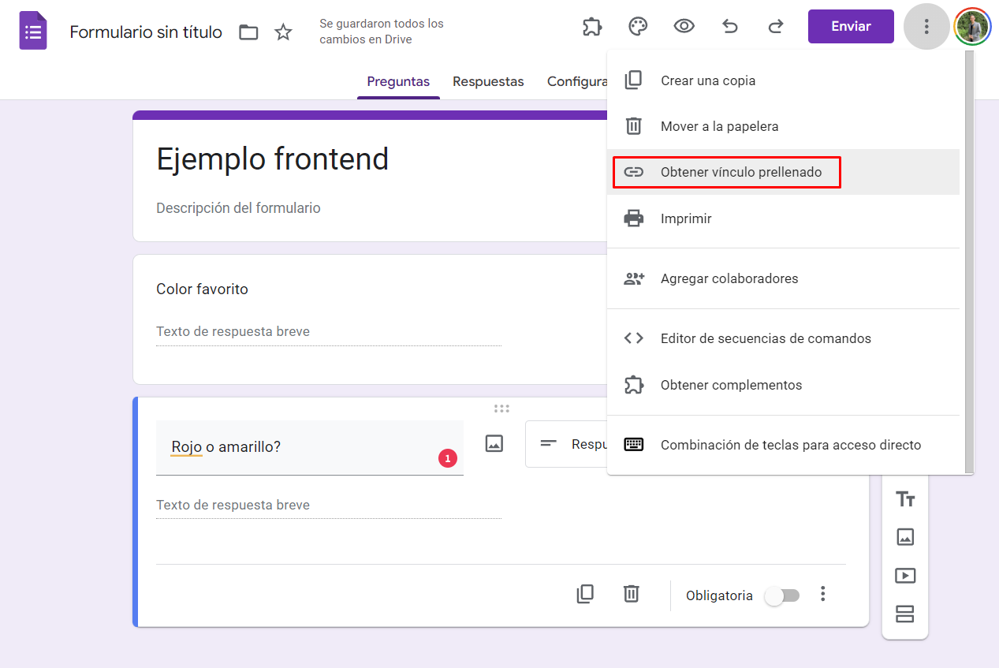

# Google Forms

<aside>
💡 En realidad es un tutorial para un truquito que te permite usar google forms como api, y google sheets como backend, y poner tu propio frontend.

</aside>

## Crear un forms

Podemos entrar a [forms.new](http://forms.new) y vamos a crear un form. En mi opinión, conviene limitarse a respuesta corta o párrafo, todo lo demás lo podemos validar por frontend… Obviamente es un hack esto, si querés algo realmente seguro hace un backend posta, pero para apps sencillas sin bad users messirve.

Lo que vamos a hacer ahora es ir a los tres puntitos, y hacer click en “Obtener vínculo prellenado”



Llenamos los campos con info placeholder, y obtenemos el vínculo:


Lo copiamos y lo llevamos a un editor de texto y buscamos primero, donde dice `viewForm` y lo reemplazamos con `formResponse`


Luego, nos vamos a dar cuenta que todos los campos que uno ingresa en el form, son tipo key pair values, y podemos separarlos. Cumplen con la estructura `entry.nnnnnnnnnn=ABCD`


Una vez que separamos todo, borramos todo lo que va después de `formResponse` y nos debería quedar algo así:


Luego, nos armamos el frontend que querramos. Yo usé un ejemplo que saqué de internet que está ok. 

Lo importante es lo siguiente:

- Hacemos un `form` con `action` al URL que armamos antes.
- Hacemos distintos `input` que tengan name
- Agregamos un botón de `submit`

```html
<form action="https://docs.google.com/forms/d/e/1FAIpQLSdcsgA-nnQhpPilIyXWoEArkI6d4IVMTDFgTt3kkE1Xt3k0dA/formResponse">
	<input type="text" name="entry.1955182896"/>
	<fieldset>
    <input type="radio" name="entry.1409938290" value="Rojo"/>
    <input type="radio" name="entry.1409938290" value="Amarillo"/>
  </fieldset>
	<button type="submit">Enviar</button>
</form>
```

Después podemos agregar todo el CSS que querramos. A mí me quedó lo siguiente:


Cuando le damos al submit, nos devuelve a google forms, y nuestra respuesta se registra en el forms. Luego podemos formatearla en el sheets, hacer lo que querramos como si fuese un gforms común.


Hay una forma de que no vuelve a gforms, y es con un código sencillo en JS:

```jsx
document.addEventListener("DOMContentLoaded", () => {
    const form = document.querySelector('.form');

    form.addEventListener('submit', event => {
        event.preventDefault();

        const formData = new FormData(form);

        fetch(form.action, {
            method: 'POST',
            body: formData,
            mode: 'no-cors'
        })
            .then(response => {
                // Dado que estamos usando 'no-cors', no podemos verificar realmente la respuesta.
                // Por lo tanto, asumimos que si llegamos a este punto, el formulario se ha enviado correctamente.
                alert('¡Formulario enviado con éxito!');
                form.reset();
            })
            .catch(error => {
                // Este bloque catch manejará errores de red, como problemas de conexión.
                alert(`Ocurrió un error al enviar el formulario: ${error.message}`);
            });
    });
});
```